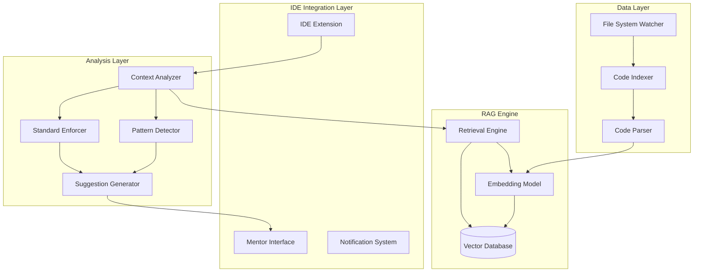

# Design Document: RepoMind

## Overview

RepoMind is a context-aware AI development tool that transforms IDEs into intelligent mentors by leveraging Retrieval Augmented Generation (RAG) to understand entire codebases. The system proactively detects when developers are reinventing existing patterns or bypassing internal standards, providing educational feedback that prevents technical debt accumulation.

The architecture follows a modular design with clear separation between indexing, analysis, and presentation layers. The system uses vector embeddings to enable semantic code search, allowing it to find functionally similar code even when syntactically different. This enables detection of duplicate functionality, inconsistent patterns, and opportunities to leverage existing solutions.

## Architecture

RepoMind follows a three-tier architecture:

1. **Data Layer**: Handles codebase indexing, embedding generation, and vector storage
2. **Analysis Layer**: Performs pattern detection, standard enforcement, and suggestion generation  
3. **Presentation Layer**: Provides IDE integration and user interaction



## Components and Interfaces

### Code Indexer
**Responsibility**: Scans, parses, and indexes the codebase for semantic search

**Key Operations**:
- `indexRepository(path: string): Promise<void>` - Initial full repository indexing
- `updateIndex(filePath: string, content: string): Promise<void>` - Incremental updates
- `removeFromIndex(filePath: string): Promise<void>` - Handle file deletions

**Implementation Details**:
- Uses Abstract Syntax Tree (AST) parsing to extract semantic code chunks
- Splits large files into logical chunks (functions, classes, modules) to stay within embedding model token limits
- Maintains metadata including file paths, line numbers, and code context
- Supports incremental indexing to minimize performance impact

### RAG Engine
**Responsibility**: Converts code to embeddings and performs semantic similarity search

**Key Operations**:
- `generateEmbedding(code: string): Promise<number[]>` - Convert code to vector representation
- `semanticSearch(query: string, limit: number): Promise<SearchResult[]>` - Find similar code
- `findSimilarPatterns(codeChunk: string): Promise<Pattern[]>` - Detect existing patterns

**Implementation Details**:
- Uses specialized code embedding models (e.g., CodeBERT, GraphCodeBERT) trained on code semantics
- Vector database (Chroma, Pinecone, or Weaviate) for efficient similarity search
- Implements approximate nearest neighbor search for sub-second query response
- Maintains separate indices for different code types (functions, classes, configurations)

### Pattern Detector
**Responsibility**: Identifies architectural patterns and coding standards from the indexed codebase

**Key Operations**:
- `detectPatterns(): Promise<DetectedPattern[]>` - Analyze codebase for common patterns
- `identifyStandards(): Promise<CodingStandard[]>` - Extract coding conventions
- `findInconsistencies(): Promise<Inconsistency[]>` - Detect pattern violations

**Implementation Details**:
- Uses clustering algorithms on code embeddings to identify similar functionality groups
- Maintains a knowledge base of detected patterns with usage frequency and examples
- Tracks pattern evolution over time to identify deprecated approaches
- Supports custom pattern definitions for organization-specific standards

### Context Analyzer
**Responsibility**: Analyzes current development context and triggers appropriate checks

**Key Operations**:
- `analyzeCurrentContext(code: string, filePath: string): Promise<AnalysisResult>` - Real-time analysis
- `detectViolations(context: AnalysisResult): Promise<Violation[]>` - Find standard violations
- `suggestImprovements(violations: Violation[]): Promise<Suggestion[]>` - Generate suggestions

**Implementation Details**:
- Monitors code changes in real-time through IDE integration
- Uses debouncing to avoid excessive analysis during rapid typing
- Maintains context about current file, project structure, and recent changes
- Integrates with language servers for syntax and semantic information

### Standard Enforcer
**Responsibility**: Detects violations of established patterns and generates corrective suggestions

**Key Operations**:
- `checkCompliance(code: string, patterns: Pattern[]): Promise<ComplianceResult>` - Validate against standards
- `generateSuggestion(violation: Violation): Promise<Suggestion>` - Create actionable suggestions
- `trackViolations(violations: Violation[]): Promise<void>` - Maintain violation history

**Implementation Details**:
- Maintains configurable rules for different types of violations
- Uses semantic similarity to detect when developers are reimplementing existing functionality
- Provides confidence scores for suggestions based on pattern match strength
- Supports whitelisting for legitimate exceptions to patterns

### Mentor Interface
**Responsibility**: Presents suggestions and explanations to developers in a non-intrusive manner

**Key Operations**:
- `displaySuggestion(suggestion: Suggestion): void` - Show suggestion to user
- `explainReasoning(suggestion: Suggestion): string` - Provide educational context
- `showExamples(pattern: Pattern): void` - Display relevant code examples

**Implementation Details**:
- Integrates with IDE notification systems and sidebar panels
- Provides progressive disclosure of information (summary → details → examples)
- Supports keyboard shortcuts for quick actions (accept, dismiss, learn more)
- Tracks user interactions to improve suggestion relevance over time

## Data Models

### CodeChunk
```typescript
interface CodeChunk {
  id: string;
  filePath: string;
  startLine: number;
  endLine: number;
  content: string;
  embedding: number[];
  codeType: 'function' | 'class' | 'module' | 'config';
  language: string;
  lastModified: Date;
}
```

### DetectedPattern
```typescript
interface DetectedPattern {
  id: string;
  name: string;
  description: string;
  examples: CodeChunk[];
  usageCount: number;
  category: 'database' | 'api' | 'security' | 'utility' | 'configuration';
  confidence: number;
  lastSeen: Date;
}
```

### Suggestion
```typescript
interface Suggestion {
  id: string;
  type: 'pattern_violation' | 'duplicate_functionality' | 'security_concern' | 'best_practice';
  severity: 'info' | 'warning' | 'error';
  message: string;
  explanation: string;
  suggestedCode?: string;
  relatedPatterns: DetectedPattern[];
  codeExamples: CodeChunk[];
  filePath: string;
  lineRange: { start: number; end: number };
}
```

### AnalysisResult
```typescript
interface AnalysisResult {
  codeChunk: CodeChunk;
  similarChunks: CodeChunk[];
  applicablePatterns: DetectedPattern[];
  violations: Violation[];
  confidence: number;
  analysisTimestamp: Date;
}
```

## Correctness Properties

*A property is a characteristic or behavior that should hold true across all valid executions of a system—essentially, a formal statement about what the system should do. Properties serve as the bridge between human-readable specifications and machine-verifiable correctness guarantees.*

Before writing the correctness properties, I need to analyze the acceptance criteria from the requirements to determine which ones are testable as properties.

Based on the prework analysis, I'll now write the consolidated correctness properties:

**Property 1: Comprehensive Indexing**
*For any* repository with source code files, the Code_Indexer should successfully index all supported language files and automatically include new files when added
**Validates: Requirements 1.1, 1.4, 1.5**

**Property 2: Real-time Performance**
*For any* code analysis or modification operation, the system should respond within the specified time limits (index updates within 5 seconds, suggestions within 2 seconds, RAG queries within 2 seconds for 95% of cases)
**Validates: Requirements 1.2, 3.5, 8.2**

**Property 3: Pattern Detection and Knowledge Base**
*For any* codebase analysis, the Pattern_Detector should identify architectural patterns, security protocols, and inconsistencies, while maintaining a persistent knowledge base of detected patterns
**Validates: Requirements 2.1, 2.2, 2.3, 2.4, 2.5**

**Property 4: Context-Aware Suggestion Generation**
*For any* code being written, when violations or improvements are detected (pattern violations, raw SQL usage, duplicate functionality), the Standard_Enforcer should generate appropriate suggestions
**Validates: Requirements 3.1, 3.2, 3.3, 3.4**

**Property 5: Comprehensive Suggestion Presentation**
*For any* suggestion generated, the Mentor_Interface should provide complete information including reasoning, relevant code examples, security explanations where applicable, and file references
**Validates: Requirements 4.1, 4.2, 4.3, 4.4**

**Property 6: Technical Debt Management**
*For any* codebase analysis, the Standard_Enforcer should identify and track technical debt items (inconsistencies, deprecated patterns, refactoring opportunities) with persistent history
**Validates: Requirements 5.1, 5.2, 5.3, 5.4, 5.5**

**Property 7: Adaptive Learning Support**
*For any* developer interaction, the Mentor_Interface should provide contextually appropriate guidance, track learning progress, and adapt suggestions based on familiarity and experience
**Validates: Requirements 6.2, 6.3, 6.4, 6.5**

**Property 8: User Interaction and Feedback**
*For any* suggestion presented, the interface should allow dismissal with feedback collection and provide non-intrusive display options
**Validates: Requirements 4.5, 7.2**

**Property 9: Automation and Configuration**
*For any* accepted suggestion or system configuration, the system should automatically apply changes where possible and respect user-defined settings for suggestion frequency, exclusions, and performance balance
**Validates: Requirements 7.3, 7.4, 7.5, 8.4, 8.5**

**Property 10: Scalability and Efficiency**
*For any* large repository (up to 1 million lines of code), the system should maintain performance through incremental indexing and efficient resource usage
**Validates: Requirements 8.1, 8.3**

**Property 11: RAG Engine Retrieval**
*For any* code analysis request, the RAG_Engine should retrieve relevant patterns from the indexed codebase using semantic similarity
**Validates: Requirements 1.3**

## Error Handling

The system implements comprehensive error handling across all components:

### Indexing Errors
- **File Access Errors**: When files cannot be read due to permissions or corruption, log the error and continue with other files
- **Parsing Errors**: When code cannot be parsed due to syntax errors, store the file with minimal metadata and retry after modifications
- **Embedding Generation Errors**: When embedding models fail, implement fallback to simpler text-based indexing
- **Vector Database Errors**: Implement retry logic with exponential backoff for database connection issues

### Analysis Errors
- **Context Analysis Failures**: When real-time analysis fails, degrade gracefully to basic syntax checking
- **Pattern Detection Errors**: When pattern detection fails, continue with existing pattern knowledge
- **Suggestion Generation Errors**: When suggestion generation fails, provide generic best practice recommendations

### Integration Errors
- **IDE Communication Errors**: Implement heartbeat monitoring and automatic reconnection for IDE extensions
- **Performance Degradation**: When system performance drops below thresholds, automatically reduce analysis frequency
- **Configuration Errors**: Validate all configuration changes and provide clear error messages for invalid settings

### Recovery Mechanisms
- **Graceful Degradation**: System continues to function with reduced capabilities when components fail
- **Automatic Recovery**: Implement health checks and automatic restart for failed components
- **Data Consistency**: Ensure index consistency through transaction-like operations and rollback capabilities

## Testing Strategy

RepoMind requires a dual testing approach combining unit tests for specific scenarios and property-based tests for comprehensive validation:

### Unit Testing Focus
- **Integration Points**: Test IDE extension communication, vector database connections, and file system interactions
- **Edge Cases**: Test with malformed code, extremely large files, and unusual project structures  
- **Error Conditions**: Test network failures, permission errors, and resource exhaustion scenarios
- **Specific Examples**: Test known pattern detection scenarios and suggestion generation for common violations

### Property-Based Testing Focus
- **Universal Properties**: Verify that correctness properties hold across all valid inputs using randomized testing
- **Comprehensive Coverage**: Generate diverse codebases, file modifications, and user interactions to test system behavior
- **Performance Properties**: Validate timing requirements across different repository sizes and complexity levels
- **Semantic Consistency**: Ensure that similar code patterns are consistently detected regardless of syntactic variations

### Testing Configuration
- **Property Test Framework**: Use Hypothesis (Python), fast-check (TypeScript), or QuickCheck (Haskell) depending on implementation language
- **Minimum Iterations**: Each property test must run at least 100 iterations to ensure statistical confidence
- **Test Tagging**: Each property test must include a comment referencing its design document property:
  - Format: `// Feature: repo-mind, Property 1: Comprehensive Indexing`
- **Continuous Integration**: All tests must pass before code deployment, with property tests running on representative codebases

### Test Data Strategy
- **Synthetic Codebases**: Generate codebases with known patterns, violations, and inconsistencies for controlled testing
- **Real-World Samples**: Test against open-source repositories to validate real-world performance
- **Language Coverage**: Ensure test coverage across all supported programming languages
- **Scale Testing**: Test with repositories ranging from small projects to enterprise-scale codebases

The testing strategy ensures that RepoMind maintains high reliability while handling the complexity and variability of real-world software development environments.